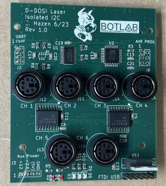

# DOSI Laser control firmware

## Issues

For some reason the I2C signals are not wired to the TWI pins on the MCU.
Probably it's worth patching this on the first PCB.

## Notes

This is firmware (C code) for the microcontroller on the isolated I2C
master board which controls the lasers in a DOSI box.

The firmware accepts control commands from either a USB/serial adapter
(connected to a host computer via USB) or the Zynq embedded computer
in the DOSI box.  The protocol used is asynchronous serial (UART) with
the following settings:

* 19200 Baud
* 8 data bits
* 1 stop bit
* no parity

The firmware will send at power-up a brief message including the
firmware version, followed by a prompt "> ".

Commands consist of an ASCII text string followed by a CR and/or LF
character.  Each command will produce a response, which consists of
zero or more lines of text, followed again by the prompt "> ".

Each command consists of a single alphabetic character, followed by
zero or more space-separated arguments.  The arguments may be decimal
numbers, or hex numbers with "0x" prefix.

Here is a preliminary list of commands:

    H                 - help, list commands
    L <value>         - set on-board LEDs to binary value
    I <laser> <value> - set laser current <laser> 0-5 <value> 0-255
	R <laser> [<ch>]  - read laser ADC optional <ch> 0-7 or all
	E <laser>         - enable laser
	D [<laser>]       - disable laser (or all if not specified)

